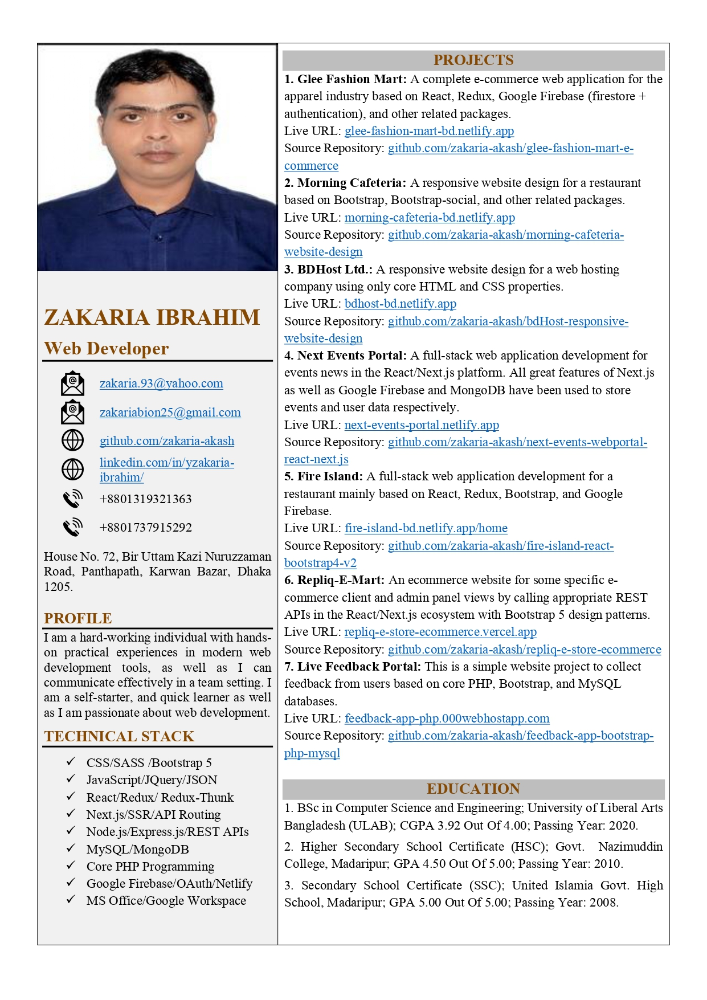
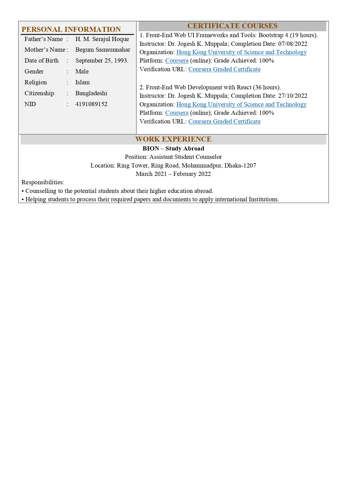

Hi there 👋
 
 
I am **_ZAKARIA IBRAHIM_**
 
 
I completed my bachelor's degree major in Computer Science and Engineering with excellent academic records. I have developed and deployed some websites using advanced CSS properties, React/Redux, Next.js, Bootstrap, Google Firebase, MongoDB, and other modern web development tools. I have also practiced Node.js/Express.js, Core PHP, and MySQL. I believe that I am a hardworking, self-starter, and quick learner as well as I am passionate about web development.
 
 
My Profile:
  

   

