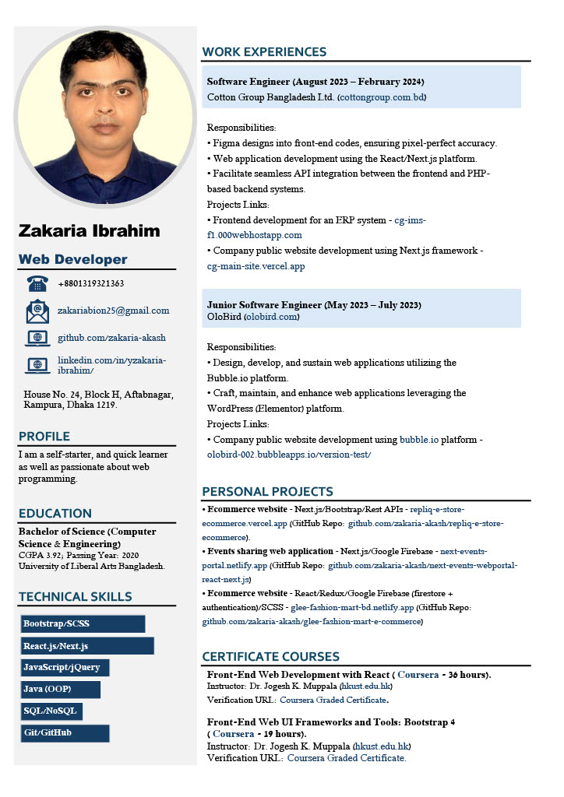

 

**_ZAKARIA IBRAHIM_**

 
 
My practical experience spans the development and deployment of numerous sophisticated websites utilizing advanced CSS properties, SASS, Bootstrap 5, React.js, Next.js, Node.js, Express.js, Google Firebase, MongoDB, and other contemporary web development tools. Additionally, I possess skills in Core C/C++, Java, PHP, Python (OOP), and MySQL.
Beyond my technical expertise, I am characterized by my strong work ethic, self-initiative, and aptitude for rapid learning. I am deeply passionate about web application development and committed to delivering high-quality solutions that meet both user requirements and industry standards.
 
 
My Profile:
  

   
