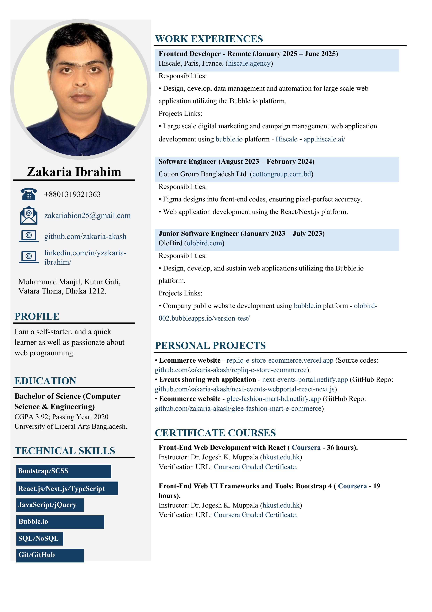

<!-- TOP WAVE BANNER -->

<!-- Animated Typing SVG -->

 

<!-- Social & Contact Badges -->

 

---

## 🧑‍💻 About Me

I'm a **Full-Stack Web Developer** from Dhaka, Bangladesh with a passion for building clean, efficient, and user-centered web applications. With a CS degree and solid industry experience across multiple companies, I craft scalable digital solutions that make a real impact.

- 🏢 **Currently:** Junior Full-Stack Developer @ **[Betopia Group Ltd.](https://betopiagroup.com)** *(Jan 2026 – Present)*
- 🎓 **BSc in Computer Science & Engineering** — University of Liberal Arts Bangladesh *(CGPA: 3.92)*
- 💡 Passionate about **React.js, Next.js, Node.js** and modern full-stack architecture
- 🌐 Enterprise experience with **Bubble.io** no-code/low-code platform (France & BD clients)
- 🤖 Exploring **n8n** for intelligent workflow automation
- 📍 Floor 6, House 67, Probal Housing Society, Mohammadpur, **Dhaka 1207**
- 📞 **+8801917133759** &nbsp;|&nbsp; 📧 **zakariabion25@gmail.com**

 

---

## 💼 Work Experience

<table>
<tr>
<td>

### 🔵 Junior Full-Stack Developer &nbsp; `Jan 2026 – Present`
**[Betopia Group Ltd.](https://betopiagroup.com)** &nbsp;·&nbsp; Dhaka, Bangladesh

- Dynamic & responsive front-end development using **React.js / Next.js**
- Robust back-end & REST API implementation using **Node.js / Express.js**
- Close collaboration with UI/UX designers for seamless user experiences
- Write clean, maintainable, and well-documented code
- Debug, troubleshoot, and resolve technical issues efficiently

</td>
</tr>
<tr>
<td>

### 🟠 Software Engineer &nbsp; `Aug 2025 – Dec 2025`
**[King Digital Recharge Ltd.](https://kingdigital.com.bd)** &nbsp;·&nbsp; Dhaka, Bangladesh

- Built and maintained responsive web applications using **React.js, Next.js & Spring Boot**
- Implemented state management with **Redux Toolkit** & **Context API**; integrated REST APIs for scalable, data-driven apps
- Developed and maintained reusable UI components leveraging **Bootstrap** & **Tailwind CSS**

</td>
</tr>
<tr>
<td>

### 🟡 Frontend Developer — Remote &nbsp; `Jan 2025 – Jun 2025`
**[Hiscale](https://hiscale.agency)** &nbsp;·&nbsp; Paris, France

- Designed, developed, and automated large-scale web applications using the **Bubble.io** platform
- 🔗 **Delivered:** [**app.hiscale.ai**](https://app.hiscale.ai) — Enterprise digital marketing & campaign management SaaS

</td>
</tr>
<tr>
<td>

### 🟢 Junior Software Engineer &nbsp; `Jan 2023 – Feb 2024`
**[OloBird](https://olobird.com)**

- Designed, developed, and sustained web applications utilizing the **Bubble.io** platform
- 🔗 **Delivered:** [**olobird-002.bubbleapps.io**](https://olobird-002.bubbleapps.io/version-test/) — Company public website

</td>
</tr>
</table>

---

## 🚀 Featured Projects

<table>
<tr>
<td width="50%">

### 🛍️ Repliq E-Store
**Full-Stack eCommerce Platform**

A modern eCommerce site built with **React.js & Next.js** featuring product listings, cart management, and a complete checkout flow.

`React.js` `Next.js` `Vercel`

</td>
<td width="50%">

### 📅 Next Events Portal
**Event Sharing Web Application**

A full-featured event sharing platform with **React.js & Next.js** for creating, browsing, and sharing events with a clean, modern UI.

`React.js` `Next.js` `Netlify`

</td>
</tr>
<tr>
<td width="50%">

### 👗 Glee Fashion Mart
**Fashion eCommerce Store**

A stylish fashion eCommerce platform with a modern UI, rich product catalog, and a smooth, intuitive shopping experience.

`React.js` `Bootstrap` `Netlify`

</td>
<td width="50%">

### 🌐 Hiscale — Digital Marketing SaaS
**Enterprise No-Code Platform · Professional**

Large-scale digital marketing & campaign management platform built on **Bubble.io** for a Paris-based international client.

`Bubble.io` `No-Code` `SaaS` `Enterprise`

</td>
</tr>
</table>

---

## 🛠️ Tech Stack

**⚛️ Frontend**

**🔧 Backend & Database**

**🔨 Tools & Platforms**

---

## 📊 GitHub Analytics

 

---

## 🏆 GitHub Trophies

---

## 📈 Contribution Activity

---

## 🎓 Education

| Degree | Institution | CGPA | Year |
|--------|------------|------|------|
| **Bachelor of Science — Computer Science & Engineering** | University of Liberal Arts Bangladesh | **3.92** | 2020 |

---

## 📄 Resume

  

---

**💬 Open to exciting opportunities and collaborations!**

📧 [zakariabion25@gmail.com](mailto:zakariabion25@gmail.com) &nbsp;|&nbsp; 📞 +8801917133759 &nbsp;|&nbsp; 📍 Dhaka, Bangladesh

 

*⭐ If you find my work interesting, feel free to star my repos and connect!*

<!-- FOOTER WAVE -->

